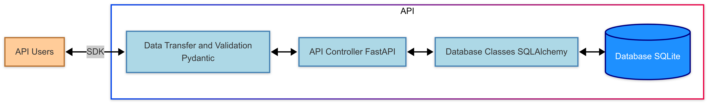

# 🎬 Projet : Construction d’un Écosystème Data pour l’Analyse Cinématographique

## 📌 Objectif du projet
Créer une plateforme complète d'analyse de données de films, depuis la structuration d'une base de données relationnelle jusqu'au développement d'une API REST performante, d’un SDK Python, et d’une application web interactive.

---

## ⚙️ Architecture mise en place

Le projet repose sur une architecture data complète intégrant :
- Une base de données **relationnelle SQLite3** structurée à partir de fichiers CSV bruts (MovieLens)
- Une **API RESTful** robuste construite avec **FastAPI**
- Un **SDK Python** facilitant l'interaction avec l’API
- Une **application Streamlit** pour la visualisation et l’exploration des données

---

## 🧱 Phase 1 — Conception Backend & Déploiement API

### 🔹 Modélisation et création de la base de données
- Transformation de plusieurs fichiers CSV (`movies.csv`, `ratings.csv`, `tags.csv`, `links.csv`) en une base SQLite relationnelle
- Modélisation des relations entre entités : films, utilisateurs, notes, tags, liens externes
- Utilisation des **clés primaires composées**, des **clés étrangères**, et activation de l'intégrité référentielle

### 🔹 Développement de l'API avec FastAPI
- Mise en place de **plusieurs endpoints REST** pour interroger les films, les notes, les tags et les identifiants externes
- Validation des données entrantes avec **Pydantic**
- ORM avec **SQLAlchemy** pour gérer les requêtes à la base de données
- Documentation automatique de l'API avec **Swagger UI** et **ReDoc**

### 🔹 Packaging SDK Python
- Création d’un **package Python réutilisable** permettant de consommer l’API
- Implémentation de fonctions client pour récupérer facilement les films, tags, notes, liens, etc.
- Préparation à la distribution sur PyPI

### 🔹 Déploiement
- Conteneurisation de l'API avec **Docker**
- Préparation du projet au déploiement cloud (AWS, Azure, Render, etc.)
- Mise à disposition d'une version on-premise via conteneur

---

## 📊 Phase 2 — Analyse & Visualisation des Données

### 🔹 Exploration des données via l’API
- Utilisation du SDK pour interroger les films et leurs évaluations
- Analyse exploratoire : répartition des notes, genres dominants, profils d’utilisateurs

### 🔹 Application Streamlit interactive
- Développement d’une interface web connectée à l’API
- Visualisation dynamique : histogrammes, filtres par genres, scores moyens, tags
- Intégration de graphiques interactifs et de recherches avancées

---

## 🧰 Stack technique

| Domaine                  | Outils & technologies utilisés         |
|--------------------------|----------------------------------------|
| Base de données          | SQLite, SQL                           |
| Backend / API            | FastAPI, SQLAlchemy, Pydantic         |
| Client Python (SDK)      | httpx, packaging                      |
| Visualisation            | Streamlit, matplotlib, seaborn        |
| Conteneurisation         | Docker                                |
| Documentation API        | Swagger UI, ReDoc                     |
| Dataset                  | MovieLens (public, 100k+ évaluations) |

---

## 📦 Livrables du projet

- ✅ Base de données relationnelle prête à l’emploi
- ✅ API RESTful documentée et fonctionnelle
- ✅ SDK Python modulaire et réutilisable
- ✅ Application Streamlit intuitive pour l’exploration des données
- ✅ Documentation complète (code, API, schémas, architecture)

---

## 💼 Compétences démontrées

- Structuration et normalisation de données brutes
- Développement d’API professionnelles avec gestion des erreurs
- Génération automatique de documentation technique
- Industrialisation d’un package Python
- Conception d’une application interactive de data visualisation
- Mise en production locale (Docker) et préparation au cloud
